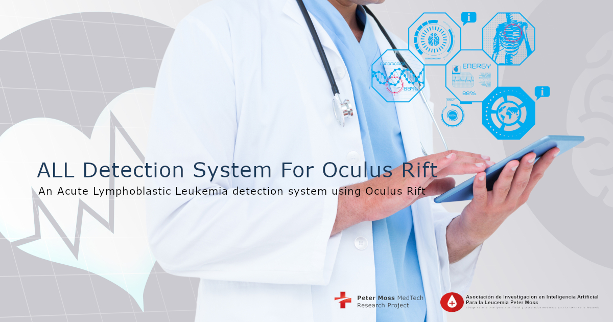

# Asociación de Investigacion en Inteligencia Artificial Para la Leucemia Peter Moss
## Acute Lymphoblastic Leukemia Detection System For Oculus Rift

    

 

 

&nbsp;

# Introduction

The **Acute Lymphoblastic Leukemia Detection System For Oculus Rift** Combines [Oculus Rift](https://www.oculus.com/rift/)'s Virtual Reality technologies with a Deep Learning classifier to provide real-time classification of [Acute Lymphoblastic Leukemia](https://www.leukemiaairesearch.com/research/leukemia) in peripheral blood samples within a Virtual Reality environment.

The classifier used in this project is the [HIAS Acute Lymphoblastic Leukemia Classifier](https://github.com/aiial/hias-all-oneapi-classifier) which is trained on the [Acute Lymphoblastic Leukemia Image Database for Image Processing](https://homes.di.unimi.it/scotti/all) dataset. The classifier achieves 97% accuracy at detecting Acute Lymphoblastic Leukemia Lymphoblasts in images of peripheral blood samples.

&nbsp;

# DISCLAIMER

_This project should be used for research purposes only. The purpose of the project is to show the potential of Artificial Intelligence and Virtual Reality for medical support systems such as diagnostic systems._

_Although the model used is accurate and shows good results both on paper and in real world testing, it is trained on a small amount of data and needs to be trained on larger datasets to really evaluate it's accuracy._

_Developers that have contributed to this repository have experience in using Artificial Intelligence for detecting certain types of cancer. They are not doctors, medical or cancer experts._

&nbsp;

# Acute Lymphoblastic Leukemia

[Acute lymphoblastic leukemia (ALL)](https://www.leukemiaairesearch.com/research/leukemia), also known as Acute Lymphocytic Leukemia, is a cancer that affects the lymphoid blood cell lineage. It is the most common leukemia in children, and it accounts for 10-20% of acute leukemias in adults. The prognosis for both adult and especially childhood ALL has improved substantially since the 1970s. The 5- year survival is approximately 95% in children. In adults, the 5-year survival varies between 25% and 75%, with more favorable results in younger than in older patients.

For more information about Acute Lymphoblastic Leukemia  please visit our [Leukemia Information Page](https://www.leukemiaairesearch.com/research/leukemia)

&nbsp;

# Oculus Rift

This project uses the orginal [Oculus Rift](https://www.oculus.com/rift/) for Virtual Reality and Oculus Touch.

&nbsp;

# Unity 3D

This project uses [Unity 3d](https://unity.com/ "Unity 3d"), a real-time 3D development platform.

&nbsp;

# GETTING STARTED

Ready to get started ? Head over to the [Getting Started guide](https://all-detection-system-for-oculus-rift.readthedocs.io/en/latest/) for instructions on how to download/install and setup the Acute Lymphoblastic Leukemia Detection System For Oculus Rift.

&nbsp;

# Contributing
Asociación de Investigacion en Inteligencia Artificial Para la Leucemia Peter Moss encourages and welcomes code contributions, bug fixes and enhancements from the Github community.

Please read the [CONTRIBUTING](CONTRIBUTING.md "CONTRIBUTING") document for a full guide to forking our repositories and submitting your pull requests. You will also find our code of conduct in the [Code of Conduct](CODE-OF-CONDUCT.md) document.

## Contributors
- [Adam Milton-Barker](https://www.leukemiaairesearch.com/association/volunteers/adam-milton-barker "Adam Milton-Barker") - [Asociación de Investigacion en Inteligencia Artificial Para la Leucemia Peter Moss](https://www.leukemiaresearchassociation.ai "Asociación de Investigacion en Inteligencia Artificial Para la Leucemia Peter Moss") President/Founder & Lead Developer, Sabadell, Spain

&nbsp;

# Versioning
We use SemVer for versioning.

&nbsp;

# License
This project is licensed under the **MIT License** - see the [LICENSE](LICENSE "LICENSE") file for details.

&nbsp;

# Bugs/Issues
We use the [repo issues](issues "repo issues") to track bugs and general requests related to using this project. See [CONTRIBUTING](CONTRIBUTING.md "CONTRIBUTING") for more info on how to submit bugs, feature requests and proposals.