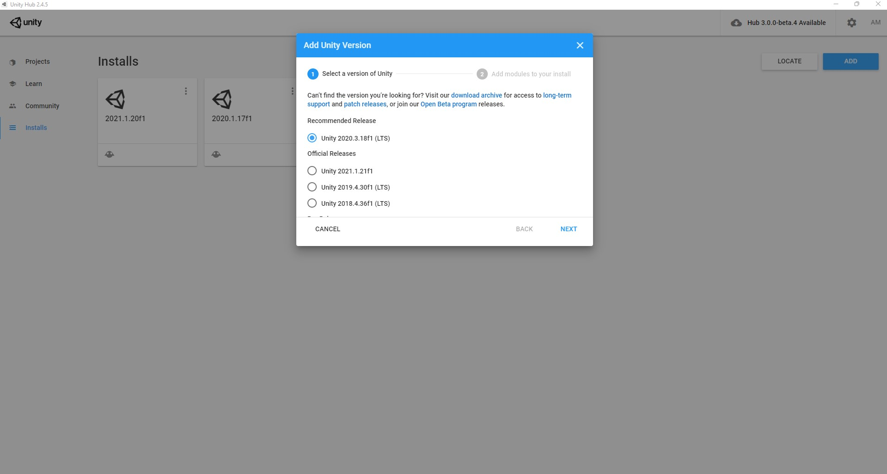
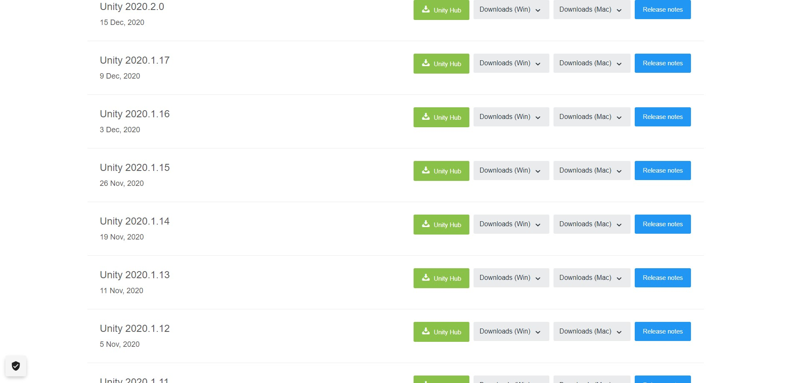
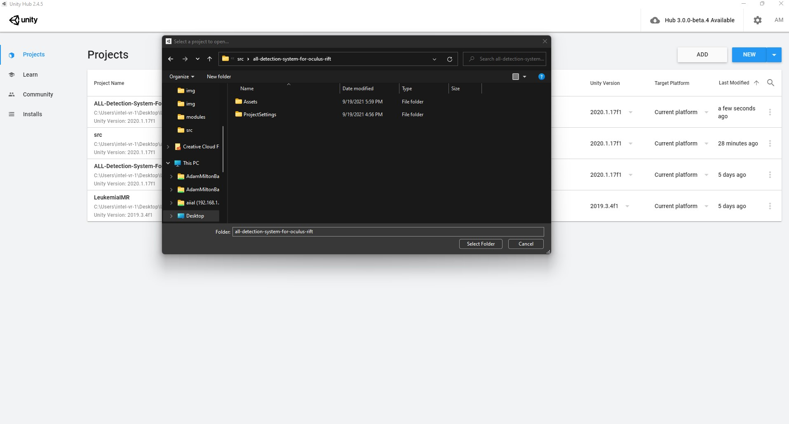
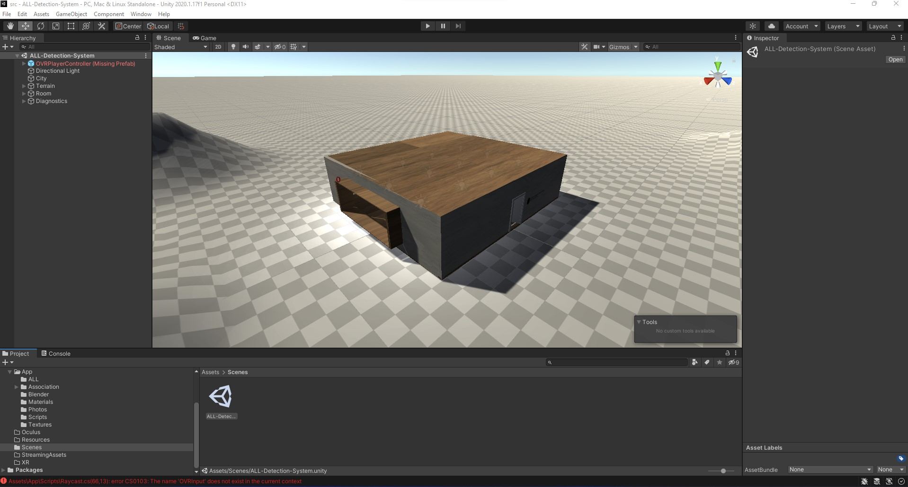
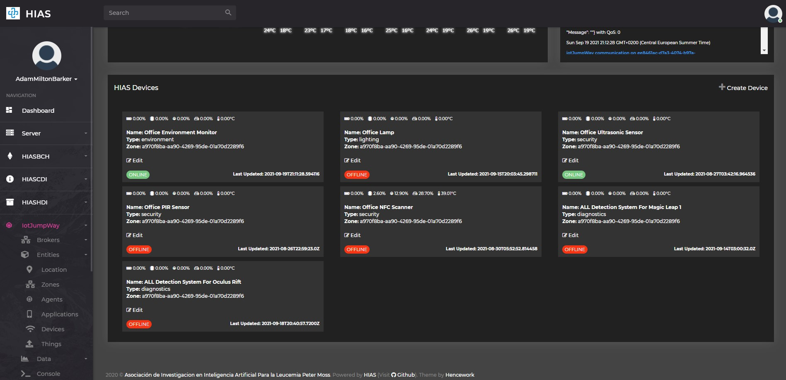
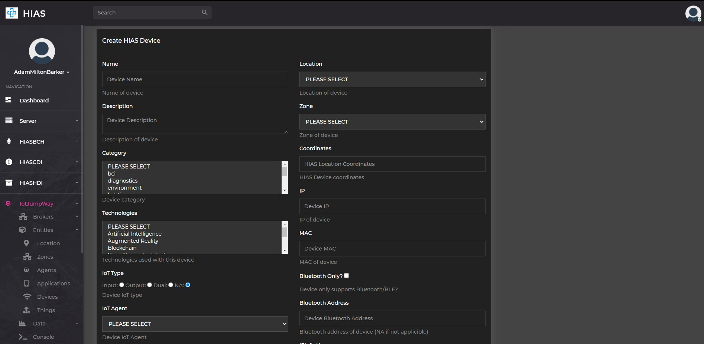
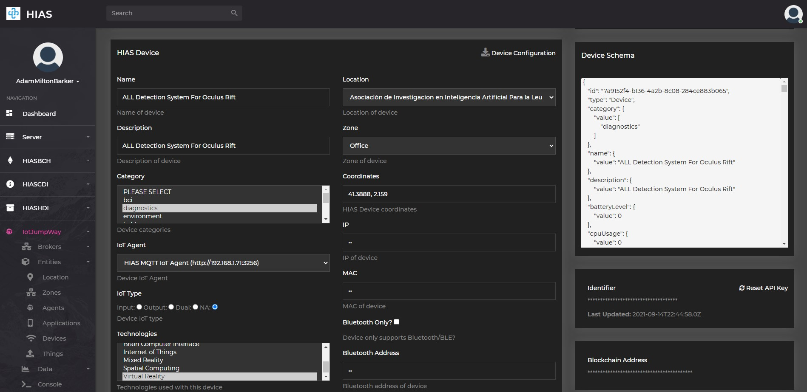
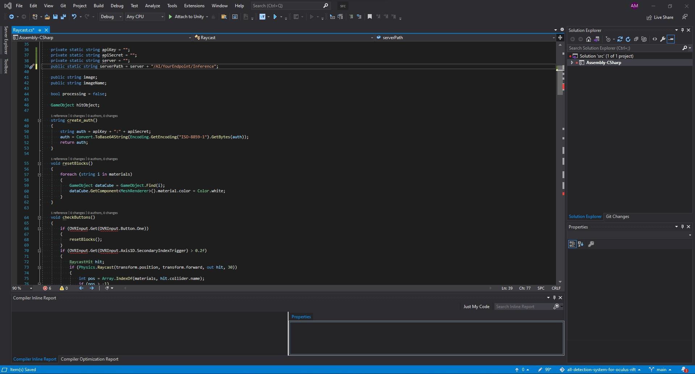
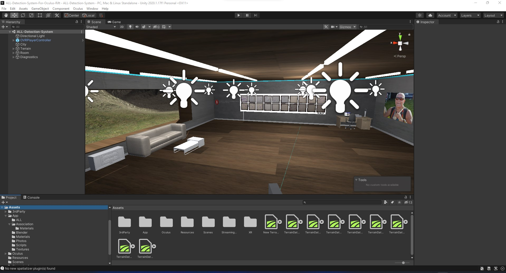

# Installation (Windows)


# Introduction
This guide will take you through the installation process for the **Acute Lymphoblastic Leukemia Detection System For Oculus Rift** on your Windows machine.

&nbsp;

# Prerequisites
You will need to ensure you have the following prerequisites installed and setup.

## HIAS Core
For this project you will need a functioning [HIAS Core](https://github.com/aiial/hias-core). To install HIAS Core follow the [HIAS Core Installation Guide](https://hias-core.readthedocs.io/en/latest/installation/ubuntu/)

## HIAS Acute Lymphoblastic Leukemia Classifier
For this project you will need a running [HIAS Acute Lymphoblastic Leukemia Classifier](https://github.com/aiial/hias-all-oneapi-classifier) on your Raspberry Pi.

&nbsp;

# Clone the repository

Clone the [Acute Lymphoblastic Leukemia Detection System For Oculus Rift](https://github.com/aiial/all-detection-system-for-oculus-rift " Acute Lymphoblastic Leukemia Detection System For Oculus Rift") repository from the [Peter Moss MedTech Research Project](https://github.com/aiial "Peter Moss MedTech Research Project") Github Organization.

To clone the repository make sure you have Git installed. Now navigate to the a directory on your device using commandline, and then use the following command.

``` bash
 git clone https://github.com/aiial/all-detection-system-for-oculus-rift.git
```

Once you have used the command above you will see a directory called **all-detection-system-for-oculus-rift** in your home directory.

``` bash
 ls
```

Using the ls command in your home directory should show you the following.

``` bash
 all-detection-system-for-oculus-rift
```

Navigate to the **all-detection-system-for-oculus-rift** directory, this is your project root directory for this tutorial.

&nbsp;

# Unity Hub
For the Oculus Rift app you need Unity. First you need to download Unity Hub. You can follow the [Installing the Unity Hub](https://docs.unity3d.com/Manual/GettingStartedInstallingHub.html) in the Unity documentation to do so.



Go to the **Installs** tab in Unity Hub and select **2020.1.17f1 (LTS)**, click next and continue until Unity 2020.1.17f1 (LTS) is installed.



If you cannot find 2020.1.17f1 (LTS) in the list then visit the [downloads archive](https://unity3d.com/get-unity/download/archive), switch to the `Unity 2020.x` tab, find the download for 2020.1.17f1 (LTS) and click on the `Unity Hub` download button.



Click on the **ADD** button. This will open Windows Explorer allowing you to navigate to the project and import it.

To import ALL Detection System For Oculus Rift into Unity Hub, navigate to the **all-detection-system-for-oculus-rift/src/all-detection-system-for-oculus-rift** directory and click **Select Folder**.



Now open the project by double clicking it, once the project opens you should see a blank screen, in the project tab navigate to `Assets` -> `Scenes` and double click on the `ALL-Detection-System` scene.

&nbsp;

# Oculus Rift

Follow the **Import Latest Package Into New Project** [Import Oculus Integration Package](https://developer.oculus.com/documentation/unity/unity-import "Import Oculus Integration Package") guide to install the required Oculus Rift development tools (You don't need to create a new project, you should use the ALL Detection System For Oculus Rift Unity project).

Follow the [Configure Unity Settings for Oculus Rift](https://developer.oculus.com/documentation/unity/unity-conf-settings/?device=RIFT "Configure Unity Settings for Oculus Rift") guide to setup Unity for Oculus Rift development.

# 3rd Party Assets
This project uses some 3rd party assets for the [Unity Asset Store](https://assetstore.unity.com/ "Unity Asset Store").

- [Big Furniture Pack](https://assetstore.unity.com/packages/3d/props/furniture/big-furniture-pack-7717)
- [Terrain Textures Pack Free](https://assetstore.unity.com/packages/2d/textures-materials/nature/terrain-textures-pack-free-139542)
- [Standard Assets (for Unity 2018.4)](https://assetstore.unity.com/packages/essentials/asset-packs/standard-assets-for-unity-2018-4-32351)
- [HQ Laptop Computer](https://assetstore.unity.com/packages/3d/props/electronics/hq-laptop-computer-42030)
- [Printer Lowpoly](https://assetstore.unity.com/packages/3d/props/electronics/printer-lowpoly-4996)

To import these assets click on **Open In Unity** and then click **Import**. Once you have imported the assets, they will appear in the scene.  Once you have imported the assets, move them to the **src/all-detection-system-for-oculus-rift/Assets/3rdParty** directory.

&nbsp;

# HIAS

This device is a HIAS network device and uses the HIAS MQTT Broker to communicate with the HIAS network. To setup a device on the HIAS network, head to the HIAS UI.

The HIAS network is powered by a context broker that stores contextual data and exposes the data securely to authenticated HIAS applications and devices.

Each HIAS device has a JSON representation stored in the HIASCDI Context Broker that holds their contextual information.

## Device


To create a HIAS device navigate to **iotJumpWay->Entities->Devices** and click on the `Create Device` button.



Once you have completed the form and submitted it you will be provided with the connection details for this device, make sure you save them. You can find the newly created device by navigating to **iotJumpWay->Entities->Devices** and clicking on the edit button for the relevant device.



On the HIAS device page you will be able to update the contextual data for the model, find the JSON representation and download the credentials for the device.

&nbsp;

# Configuration



Back in Unity, navigate to `Project` -> `Assets` -> `Scripts` and double click on `Raycast.cs`, this will open up the Raycast script in Virtual Studio.

Navigate to line **36**, here you need to enter the details for the HIAS server and device.

- The value for `apiKey` should be the `Identifier` value from the HIAS device edit page.
- The value for `apiSecret` should be your API key, if you have not saved it you can reset it using the `Reset API Key` button.
- The value for `server` should be the HIAS server hostname.
- In `serverPath` you need to replace `YourEndpoint` with the value you used for the HIAS ALL oneAPI Classifier `Inference Endpoint`. You can find this value by navigating to `AI` -> `Agents` and clicking on the edit button for the relevant AI Agent.

&nbsp;

# ALL-IDB
Now you need to import the test dataset that was used in the [HIAS Acute Lymphoblastic Leukemia Classifier](https://hias-acute-lymphoblastic-leukemia-oneapi-classifier.readthedocs.io/en/latest/usage/ubuntu/#application-testing-data) project. Copy the test data to the `Assets` -> `App` -> `ALL` directory, and the `Assets` -> `StreamingAssets` directory.

&nbsp;

# Continue
Once you have completed the above, your Unity project should look like the following screenshot.



Now you can continue with the Acute Lymphoblastic Leukemia Detection System For Oculus Rift [usage guide](../usage/windows.md) guide to learn how to use the project.

&nbsp;

# Contributing
Asociación de Investigacion en Inteligencia Artificial Para la Leucemia Peter Moss encourages and welcomes code contributions, bug fixes and enhancements from the Github community.

Please read the [CONTRIBUTING](https://github.com/aiial/all-detection-system-for-oculus-rift/blob/main/CONTRIBUTING.md "CONTRIBUTING") document for a full guide to forking our repositories and submitting your pull requests. You will also find our code of conduct in the [Code of Conduct](https://github.com/aiial/all-detection-system-for-oculus-rift/blob/main/CODE-OF-CONDUCT.md) document.

## Contributors
- [Adam Milton-Barker](https://www.leukemiaairesearch.com/association/volunteers/adam-milton-barker "Adam Milton-Barker") - [Asociación de Investigacion en Inteligencia Artificial Para la Leucemia Peter Moss](https://www.leukemiaresearchassociation.ai "Asociación de Investigacion en Inteligencia Artificial Para la Leucemia Peter Moss") President/Founder & Lead Developer, Sabadell, Spain

&nbsp;

# Versioning
We use SemVer for versioning.

&nbsp;

# License
This project is licensed under the **MIT License** - see the [LICENSE](https://github.com/aiial/all-detection-system-for-oculus-rift/blob/main/LICENSE "LICENSE") file for details.

&nbsp;

# Bugs/Issues
We use the [repo issues](https://github.com/aiial/all-detection-system-for-oculus-rift/issues "repo issues") to track bugs and general requests related to using this project. See [CONTRIBUTING](https://github.com/aiial/all-detection-system-for-oculus-rift/blob/main/CONTRIBUTING.md "CONTRIBUTING") for more info on how to submit bugs, feature requests and proposals.