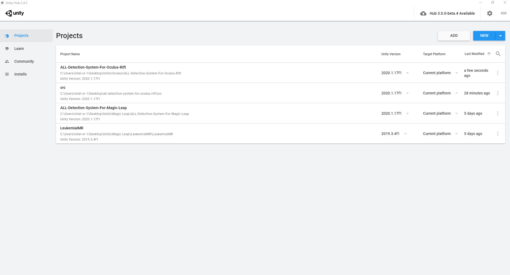
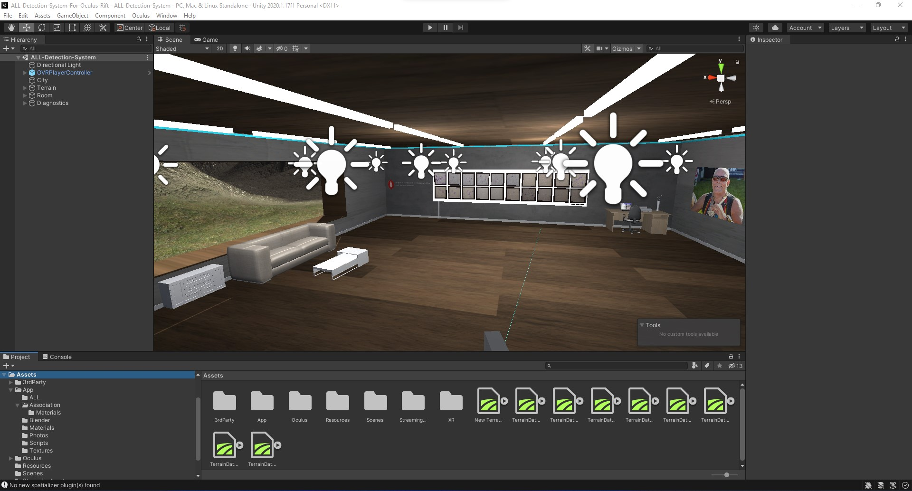
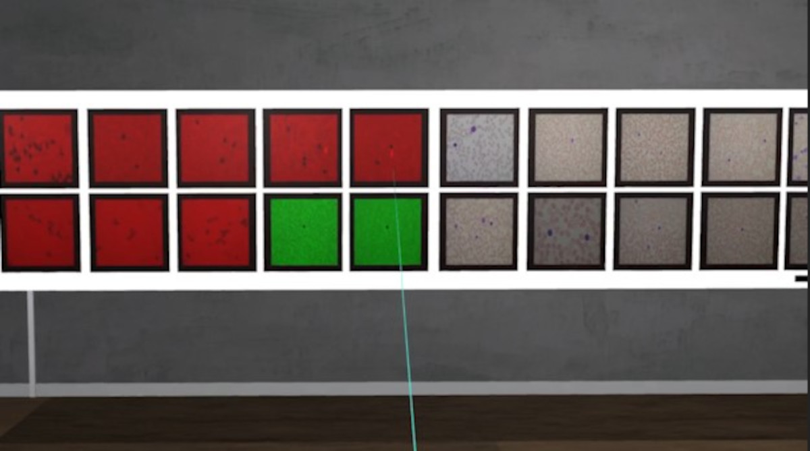
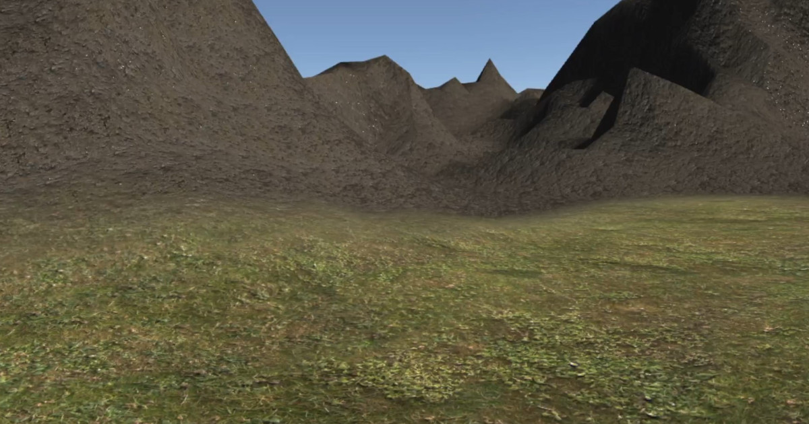

# Usage (Windows)


# Introduction
This guide will take you through the using the **Acute Lymphoblastic Leukemia Detection System For Oculus Rift** on your Windows machine.

&nbsp;

# Prerequisites
Before you continue this tutorial you need to have completed the following two guides:

- [HIAS ALL oneAPI Classifier installation](https://hias-acute-lymphoblastic-leukemia-oneapi-classifier.readthedocs.io/en/latest/)
- [ALL Detection System For Oculus Rift installation guide](../installation/windows.md)

Make sure the HIAS ALL oneAPI Classifier is runnning using the following command:

``` bash
python3 agent.py server_openvino
```

&nbsp;

# Play



First you need to open the project in Unity. To do so open Unity Hub and double click your project.



Now click the `play` button at the top of Unity, put on your headset and grab your controllers.



To use the ALL Detection System for Oculus Rift use the left hand Oculus Touch controller to maneuver around the room. To send data to the HIAS ALL oneAPI Classifier for classification use the right hand controller to point the laser at the data and hold the trigger button. The data you are pointing at will be sent to the classifier which will return it's classification.

As we know in advance from the file name of the image whether it is negative or positive, we can confirm whether the classification was a true/false negative or positive by comparing the classification to the label in the file name. The following is a key to the different colors used by the program:

- RED - True Positive
- Purple - False Positive
- Green - True Negative
- Cyan - False Negative



In addition to exploring the room you can also explore the terrain surronding the building. To do so you can use the joysticks on the Oculus Touch controllers to take a stroll into the mountains.

&nbsp;

# Contributing
Asociación de Investigacion en Inteligencia Artificial Para la Leucemia Peter Moss encourages and welcomes code contributions, bug fixes and enhancements from the Github community.

Please read the [CONTRIBUTING](https://github.com/aiial/all-detection-system-for-oculus-rift/blob/main/CONTRIBUTING.md "CONTRIBUTING") document for a full guide to forking our repositories and submitting your pull requests. You will also find our code of conduct in the [Code of Conduct](https://github.com/aiial/all-detection-system-for-oculus-rift/blob/main/CODE-OF-CONDUCT.md) document.

## Contributors
- [Adam Milton-Barker](https://www.leukemiaairesearch.com/association/volunteers/adam-milton-barker "Adam Milton-Barker") - [Asociación de Investigacion en Inteligencia Artificial Para la Leucemia Peter Moss](https://www.leukemiaresearchassociation.ai "Asociación de Investigacion en Inteligencia Artificial Para la Leucemia Peter Moss") President/Founder & Lead Developer, Sabadell, Spain

&nbsp;

# Versioning
We use SemVer for versioning.

&nbsp;

# License
This project is licensed under the **MIT License** - see the [LICENSE](https://github.com/aiial/all-detection-system-for-oculus-rift/blob/main/LICENSE "LICENSE") file for details.

&nbsp;

# Bugs/Issues
We use the [repo issues](https://github.com/aiial/all-detection-system-for-oculus-rift/issues "repo issues") to track bugs and general requests related to using this project. See [CONTRIBUTING](https://github.com/aiial/all-detection-system-for-oculus-rift/blob/main/CONTRIBUTING.md "CONTRIBUTING") for more info on how to submit bugs, feature requests and proposals.